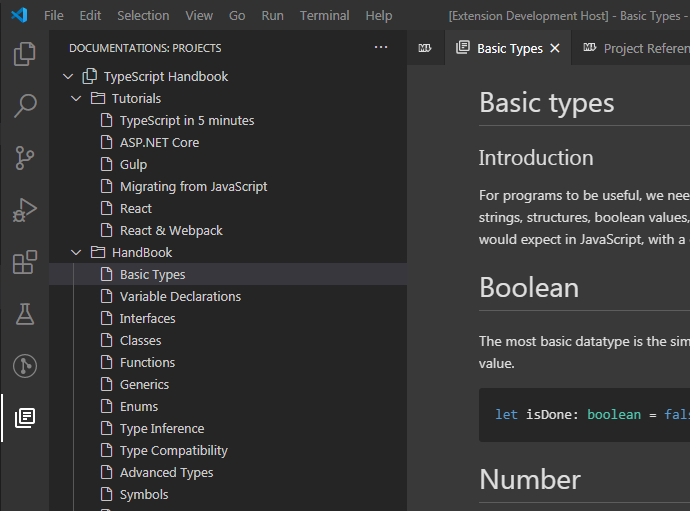
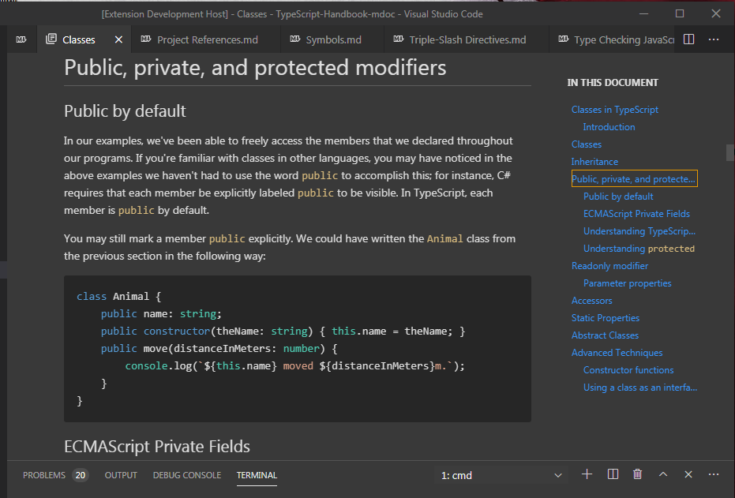
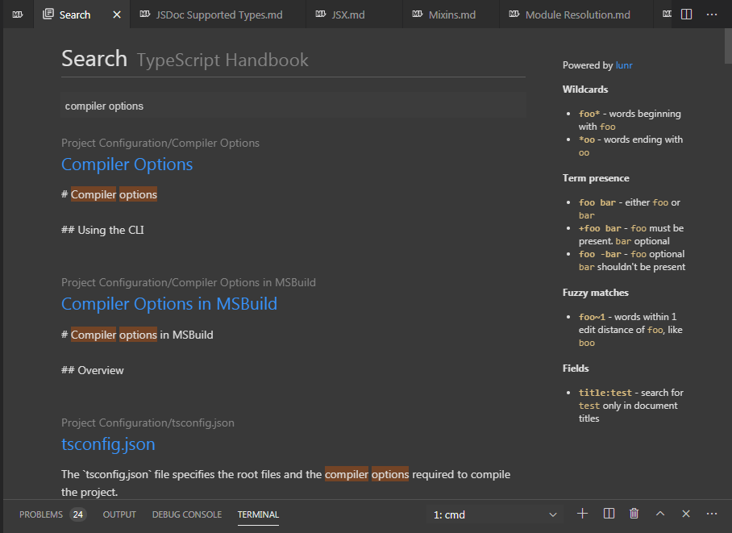
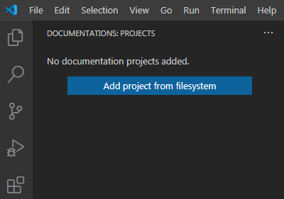
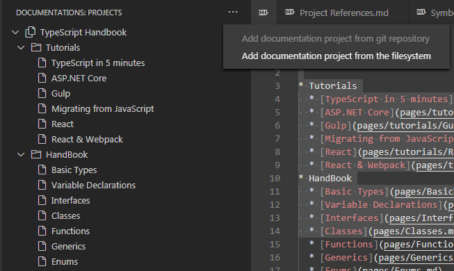

# mdoc 

**mdoc** is an offline markdown documentation viewer. It supports markdown "projects", hosted in git repositories.   
You don't have to "build" your documentation in static html pages, to be able to browse it. Whenever the docs are updated, you just have to pull in the changes (you can use the update command for this), and you can browse the latest version!        

**mdoc** provides a convenient way to open and browse your documentations inside vscode. Markdown files will be rendered on the fly when you open them (just like the builtin Markdown Preview does). You can also add notebooks (or other script files) to the project, these will be opened with the associated vscode editor.     
**mdoc** contributes a new *Documentations* view container to the activity bar. This contains the tree structure of loaded projects.

**Documentations view container with *Typescript Handbook*:**



All files will be opened in a viewer tab, you can pin it if you want, or can use it in split views.

Another benefit of using **mdoc**, is that you don't have to switch between vscode and the browser when viewing documentations. You can copy sections right ahead, and paste into Debug Console for example.


## Features

- Projects panel with the structure of a documentation project
- Auto generated table of contents for markdown files

- Full text search for all documents listed in `index.md`, powered by [lunr](https://lunrjs.com/)

- Find on page feature: it works similar to vscode's built-in find feature. Press `Ctrl+F` to open the Find Widget over the current page.    
If there are more than one matched result, you can press `Enter` and `Shift+Enter` to navigate to next or previous result when the find input box is focused
- Auto update project panel and the currently opened document on changes
- Support for linking to markdown files in external documentations (raw git url is needed)
- Quick pick for searching among documents (by title). Use the *mdoc: Open document command*(`Ctrl+F1`) to display the quick pick dialog
- Open document source: right click on document nodes in the project tree, to bring up the context menu and choose *Open document source* to open the corresponding `.md` file. On project nodes `index.md` can be opened as well.

## How to create a project

### Structure

A project needs an `index.md` file for its structure to appear in the documentation panel.   
The projects name will be inferred from the first level 1 heading in `index.md` or from the repository folder name.

For example in  *Typescript handbook* for mdoc, `index.md` looks like this:
```md
# TypeScript Handbook

* Tutorials
  * [TypeScript in 5 minutes](pages/tutorials/TypeScript%20in%205%20minutes.md)
  * [ASP.NET Core](pages/tutorials/ASP.NET%20Core.md)
  * ...
* HandBook
  * [Basic Types](pages/Basic%20Types.md)
  * [Variable Declarations](pages/Variable%20Declarations.md)
  * [Interfaces](pages/Interfaces.md)
  * [Classes](pages/Classes.md)
```

The project's title will be *Typescript Handbook*, and the list that follows builds the content in the sidebar.   
To create items either create a link entry (to link documentation pages), or a simple textual entry to create a group.    
You may nest lists in this way any depth you want

### Opening page

The opening page for the project is `README.md`, as usual for git repositories. This page shows up also, when you click on the main project node

### Example project

If you'd like to try **mdoc**, but don't have any compatible projects at hand, you can check and clone the [Typescript Handbook for mdoc](https://github.com/bxantus/TypeScript-Handbook-mdoc). This is a fork of the official repository from Microsoft, and hosts the same documentation, you can view on the [web](https://www.typescriptlang.org/docs/handbook/intro.html).    

* Check how fast pages load from your local disk, compared to the web!
* You can try searching the docs too. Despite its size (more than 500k characters) the search is pretty fast

## Adding projects to the *Documentations* container

If you have no projects added, a welcome content is presented in the *Documentations* container:



Use the `Add project from filesystem` button to add a new project. This will open a pick dialog, where you can choose the folder containing your documentation.

> **Note:** Currently you must clone the repository first, to be able to view it with mdoc.    
> Later git repository links can be added too, and mdoc will clone the repository automatically.

If there are already projects loaded, you can reach the add commands in the `...` menu:



## Known Issues

- git documentation project repositories aren't refreshed yet automatically. You can use the **Update project** command for a manual refresh


